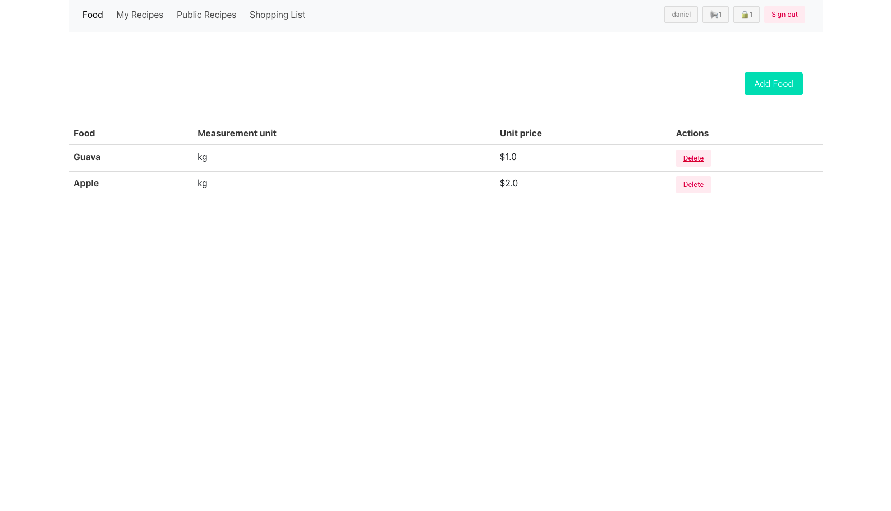

# Group-Project

> This is a ruby on rails application that allows users to create and manage recipes.

<!-- # Demo Link

Click [here](#) to view the website online.

# Video Link

Click [here](#) -->

# Screenshot

# Getting Started

To get a local copy up and running follow these simple steps.

- You can clone this repo by typing `git clone git@github.com:mmatongo/recipes-app.git` on your terminal.

- Type `cd recipes-app` to access the project on the terminal.
  
- Run `bundle install` to install all the required dependancies.

- Run `rails s` to start a development server.

# Testing

`bundle exec rspec` will run all the tests.

Also, you can run `bundle exec rspec spec/` to run specific tests.

You can also run `RAILS_ENV=test rspec spec/` to run the tests in test mode.

## Errors

If you encounter any errors, run the following commands.

- Run `rake db:drop db:create db:migrade` to drop, create and migrate a new database.

- Run `rubocop && rubocop -A` to check for and fix code errors.

# This project was built with

- Ruby on Rails

- Postgressql

- Bulma CSS Framework

- Bootstrap CSS Framework

# 👤 Authors

👤 **Daniel M. Matongo**

- GitHub: [Daniel M. Matongo](https://github.com/mmatongo)
- LinkedIn: [Daniel M. Matongo](https://linkedin.com/in/mmatongo)

👤 **Juliana Ifionu**

- GitHub: [@julie-ify](https://github.com/julie-ify)
- LinkedIn: [Juliana Ifionu](https://www.linkedin.com/in/e-ifionu/)

# 🤝 Contributing

Contributions, issues, and feature requests are welcome!

Feel free to check the [issues page](https://github.com/mmatongo/recipes-app/issues).

# Show your support

Give a ⭐️ if you like this project!

# Acknowledgement

- Hat tip to anyone whose code was a source of inspiration.
- A big thanks to [@microverseinc](https://github.com/microverseinc).

# 📝 License

This project is [MIT](./MIT.md) licensed.
